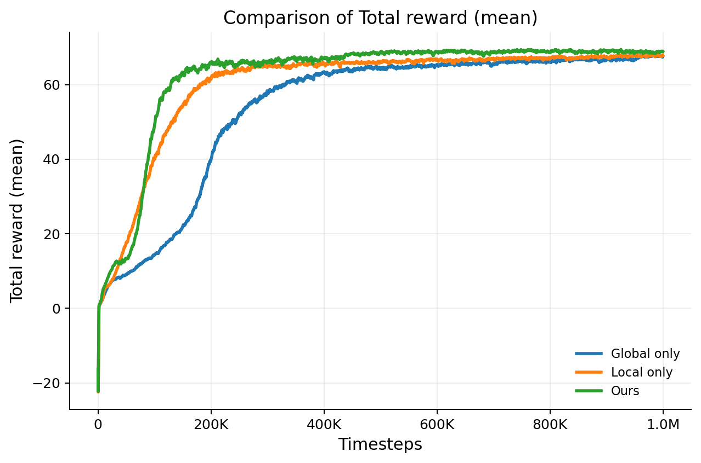

# 展示效果


# draw_training_curves

一个用于读取 TensorBoard 日志文件并绘制训练曲线对比图的 Python 工具。

该项目适合用于强化学习、模仿学习或其他训练任务中，对不同实验的训练过程进行可视化比较。脚本可以从 `events.out.tfevents.*` 文件中读取标量数据，支持多组实验对比、曲线平滑、统计聚合和图片导出。

---

## 功能特点

- 读取 TensorBoard 的 scalar 曲线
- 支持多个实验分组对比
- 支持 `median / mean / max` 聚合方式
- 支持 `iqr / std / none` 阴影带
- 支持滚动平滑
- 支持多条曲线插值到统一 step 网格后再聚合
- 支持内置配置模式和命令行模式
- 自动保存输出图片

---


## 环境要求

建议使用：

Python 3.8 及以上

依赖库：

numpy
pandas
matplotlib
tensorboard

安装方式：
```
python3 -m pip install numpy pandas matplotlib tensorboard
```
## 使用方法
- 使用前需要先修改代码中的USER CONFIG部分，TAG为需要读取训练曲线中的那个值的名称。
- GROUPS里为策略文件的位置。
- XLABEL与YLABEL为生成图片的X与Y轴名称。
- TITLE即为图片的顶部名称。
- OUTPUT为输出图片的位置。
- 修改完直接运行即可
```
python3 draw_compare_curves.py
```
## 项目结构

建议目录结构如下：

```bash
compare/
├── draw_compare_curves.py
├── checkpoints/
│   ├── exp_1/
│   │   ├── policy.pt
│   │   ├── actor.pth
│   │   └── events.out.tfevents.xxxxx
│   ├── exp_2/
│   │   └── events.out.tfevents.xxxxx
│   └── ...
├── outputs/
│   ├── Total_reward.png
│   └── ...
└── README.md

